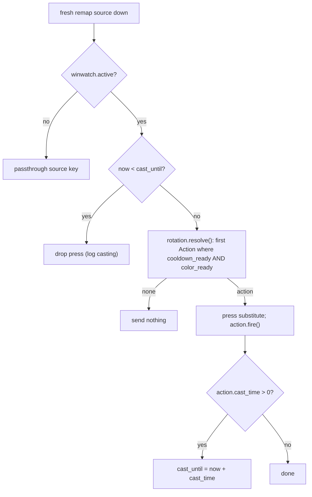

# Enhance Remap Sequences

## Goals (from remap_enhanced.md)

- Adopt the decomposed config in [pxl_remap_maps.py](c:\dev\pxlreact\pxl_remap_maps.py): `ACTIONS` (reusable skill defs), `ROTATIONS` (ordered action-name lists), `REMAPS` (source key -> rotation name). Remove `REMAPS_OLD`.
- Rename `timeout` -> `cooldown` throughout the code.
- Support `cast_time` (uninterrupted cast window).
- Collapse the `pixel` and `timed` types into a single action model that supports cooldown, color check, both, or neither.

## Resolved design decisions

- cast_time: character-global lock; presses received during an active cast are DROPPED (user re-presses). Add comments marking where queueing would hook in for a future agent.
- color_check None vs {}: normalize both to "no color gate" at build time (store `color = None`), so the per-tick check is a single `is None` identity test with no dict access. This is the more performant option, so the distinction is intentionally erased.
- Actions are shared singletons: one `Action` instance per `ACTIONS` entry, referenced by every rotation that uses it. Cooldown state (`last`) is therefore shared across rotations, which is correct - a skill on cooldown is on cooldown regardless of which remap key triggered it (e.g. `brutality` appears in both `quick` and `main`).

## Data model: [pxl_remap_maps.py](c:\dev\pxlreact\pxl_remap_maps.py)

- Delete the `REMAPS_OLD` block (lines 1-20). Keep `ACTIONS`, `ROTATIONS`, `REMAPS` as-is (they already use `cooldown` / `cast_time` / `color_check`).

## Core refactor: [pxl_remap.py](c:\dev\pxlreact\pxl_remap.py)

### Replace the three entry classes with one `Action`

Remove `RemapEntry`, `TimedEntry`, `PixelEntry` (lines 47-116) and replace with a single dataclass:

```python
@dataclass
class Action:
    name: str
    key: str
    cooldown: float = 0.0
    cast_time: float = 0.0
    px: int | None = None       # color gate; None => no color check
    py: int | None = None
    color: tuple | None = None
    last: float = field( default = -1.0, init = False )   # last fire time (perf_counter)

    def cooldown_ready( self ):
        return self.last < 0 or ( time.perf_counter() - self.last ) >= self.cooldown

    def color_ready( self ):
        if self.color is None:
            return True
        observed = get_pixel_color( self.px, self.py )
        return observed is not None and colors_similar( observed, self.color )

    def ready( self ):
        return self.cooldown_ready() and self.color_ready()

    def fire( self ):
        self.last = time.perf_counter()
```

- `cooldown = 0` is naturally "always ready by time"; `color = None` is "no color gate"; an action may define both. This is the unification: a timed action == no color_check, a pixel action == no cooldown/cast_time, and both-defined is supported.
- Carry over `describe()` for ANSI logging, combining cooldown-remaining and (when present) color match/no into one status string.

### Rename `SequenceRemap` -> `Rotation`

Keep `resolve()` (first ready entry) but holding `Action`s. The rename matches the new `ROTATIONS` vocabulary; this is the one cosmetic rename, justified by the type collapse.

### Builders (replace `build_timed`/`build_pixel`/`_BUILDERS`, lines 135-161)

```python
def build_actions( actions_cfg ):
    out = {}
    for name, c in actions_cfg.items():
        cc = c.get( 'color_check' ) or {}          # None and {} both -> no gate
        out[ name ] = Action(
            name = name, key = c[ 'key' ],
            cooldown = c.get( 'cooldown', 0.0 ),
            cast_time = c.get( 'cast_time', 0.0 ),
            px = cc.get( 'px' ), py = cc.get( 'py' ), color = cc.get( 'color' ),
        )
    return out

def build_rotations( rotations_cfg, actions ):
    # references shared Action instances so cooldown state is shared
    return { rname: Rotation( [ actions[ a ] for a in seq ] )
             for rname, seq in rotations_cfg.items() }
```

Validation: raise a clear `ValueError`/`KeyError` if a rotation lists an unknown action name, or a `REMAPS` entry names an unknown rotation.

### `PxlRemapper` changes

- Constructor signature: `__init__( self, winwatch, actions, rotations, remaps, on_quit = None )`. Build `actions = build_actions(...)`, `rotations = build_rotations(...)`, then map each `remaps` source key to its `Rotation` (reusing the existing scan-code/extended logic at lines 219-231). Drop the old `(type_tag, seq_cfg)` unpacking and `_BUILDERS`.
- Add a global cast lock field: `self._cast_until = 0.0`.
- In `_run` (lines 304-316), gate firing on the cast lock before `_fire`:

```python
self.down[ scan_code ] = True
if not self.winwatch.active:
    self.ctx.send( device, stroke ); ...; continue
if time.perf_counter() < self._cast_until:
    # Casting: drop this press. FUTURE: to support queueing instead of dropping,
    # buffer (source_name, rotation) here and flush at cast-end by shrinking the
    # await_input timeout to wake the loop when _cast_until elapses.
    print( f"{CYAN}{source_name}{RESET} {YELLOW}casting{RESET} -> dropped" )
    continue
self._fire( source_name, rotation )
```

- In `_fire` (lines 377-390): after a successful `_press_substitute` + `action.fire()`, arm the lock when the action has a cast time:

```python
if action.cast_time > 0:
    self._cast_until = time.perf_counter() + action.cast_time
```

Update log lines to use `action.name`/`action.key`.

### Resolution + cast flow



## Integration: [pxlreactHL.py](c:\dev\pxlreact\pxlreactHL.py)

- Update the import (line 21) to `from pxl_remap_maps import ACTIONS, ROTATIONS, REMAPS`.
- Update construction (line 46) to `PxlRemapper( self.winwatch, ACTIONS, ROTATIONS, REMAPS, on_quit = self.exit_application )`.

## Compatibility breaks (intentional)

- The old `( type_tag, seq_cfg )` REMAPS shape and the `timeout` key are removed; only the `ACTIONS`/`ROTATIONS`/`REMAPS` model remains.
- `build_timed` / `build_pixel` / `SequenceRemap` / `TimedEntry` / `PixelEntry` are gone. No external callers exist (`test_remap.py` has been deleted; only `pxlreactHL.py` constructs `PxlRemapper`).

## Validation

- Run `pxlreactHL.py`; on start it should print one bind line per `REMAPS` source. Press a rotation key in the target app and watch the terminal: each entry's cooldown/color status, the chosen key, and a `casting -> dropped` line when mashing during an action that has a `cast_time` (e.g. add a `cast_time` to one action to exercise it). Confirm a shared action (`brutality`) shows on cooldown via either `m` or `l`.

