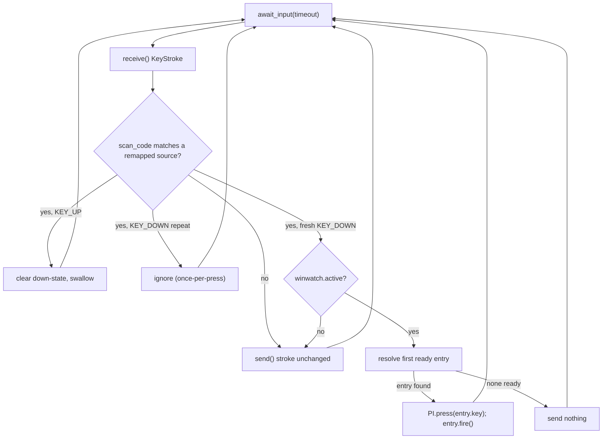

# Intercept Key Remap

## Concept

Today `PxlIntercept` (`pxl_intercept.py`) only *sends* keys through the `inputs.py` module-global context. Remapping additionally requires *capturing* hardware keystrokes. That needs a separate `Interception()` context with a keyboard filter and a blocking `await_input()` / `receive()` / `send()` loop, mirroring `_listen_to_events` (`pyinterception/src/interception/inputs.py:462`).

Driver filters are device-wide bitfields, not per-key, so we capture the whole keyboard (`FILTER_KEY_ALL`) and re-send every stroke we don't remap. Sent strokes flow downstream and are never re-intercepted, so there is no feedback loop.



## Confirmed behavior

- Fire once per discrete physical press; ignore auto-repeat KEY_DOWN until the source key is released.
- Remap only while `winwatch.active` is True; when inactive, pass the source key through unchanged so the key behaves normally outside the target app.

## New module: `pxl_remap.py`

Unify the two spec'd rule types behind a predicate, per the spec's hint that a lambda/predicate model beats two parallel dict shapes.

- `RemapEntry` (dataclass): `name`, `key` (string sent via `PxlIntercept.press`), `ready() -> bool`, `fire()`.
  - Timed entry: `ready` returns `(perf_counter() - last) >= timeout`; `fire` sets `last = perf_counter()`.
  - Pixel entry: `ready` returns `colors_similar(get_pixel_color(px, py), color)` (from `pxl_lib.py`); `fire` is a no-op.
- `SequenceRemap`: ordered `list[RemapEntry]`; `resolve()` returns the first entry whose `ready()` is True, else `None`.
- Builders translate readable config dicts into entries, e.g.:

```python
def build_timed(seq):      # {"name": {"key": "r", "timeout": 3.25}, ...}
    return SequenceRemap([TimedEntry(n, e["key"], e["timeout"]) for n, e in seq.items()])

def build_pixel(seq):      # {"name": {"key": "r", "px":.., "py":.., "color":(..)}, ...}
    return SequenceRemap([PixelEntry(n, e["key"], e["px"], e["py"], e["color"]) for n, e in seq.items()])
```

## New class: `PxlRemapper` (in `pxl_remap.py`)

- `__init__(self, pi, winwatch, binds)`: reuse the keyboard-index detection from `pxl_intercept.py:23-29`, create its own `Interception()`, `set_filter(ctx.is_keyboard, FilterKeyFlag.FILTER_KEY_ALL)`, set `ctx.keyboard = idx`. Build `source_scancode -> SequenceRemap` from `binds`, mapping each source key name to its scan code + extended flag via `get_key_information()` (`_keycodes.py:372`). Track per-source `down` state; create `stop_event` and a daemon thread.
- `_run()`: loop on `await_input(timeout_milliseconds=500)` so the thread can poll `stop_event` and exit.
  - Decode `is_up = bool(stroke.flags & KeyFlag.KEY_UP)`; match `stroke.code` (and extended bit) to a source.
  - No match: `send` unchanged.
  - Match + KEY_UP: clear down-state, swallow.
  - Match + KEY_DOWN already-down: swallow (auto-repeat).
  - Match + fresh KEY_DOWN: set down-state. If `winwatch.active`: `entry = remap.resolve()`; if `entry`, `pi.press(entry.key)` and `entry.fire()`, else send nothing. If not active: `send` the original source stroke (pass-through).
  - ANSI-highlighted logging at each branch (CYAN source/keys, MAGENTA timers/coords, GREEN fired, YELLOW no-candidate, RED errors) per `ansi.py` conventions.
- `stop()`: set `stop_event`, join thread, `ctx.destroy()` to clear the filter.

Substitute keys route through the existing `PxlIntercept.press` (`pxl_intercept.py:98`) for the project's humanized delays and async submission; those sends use the separate `inputs.py` `_g_context`, so they never re-enter the capture loop.

## Integration: `pxlreactHL.py`

- Define sample binds near `KEYBINDS` (`pxlreactHL.py:24`):

```python
REMAPS = {
    "e": ("timed", {"fireball": {"key": "r", "timeout": 3.25},
                    "volcano":  {"key": "f", "timeout": 6.33},
                    "ember":    {"key": "e", "timeout": 2.2}}),
    "q": ("pixel", {"fireball": {"key": "r", "px": 1200, "py": 1100, "color": (125, 32, 99)},
                    "volcano":  {"key": "f", "px": 950,  "py": 888,  "color": (155, 132, 79)}}),
}
```

- In `PxlReactApp.__init__` (`pxlreactHL.py:46`): after `self.PI`, build the `SequenceRemap`s and `self.remapper = PxlRemapper(self.PI, self.winwatch, ...)` (starts its thread).
- In `cleanup` (`pxlreactHL.py:143`): call `self.remapper.stop()` before `self.PI.close()`.

## Compatibility notes (no back-compat preserved)

- Capturing the full keyboard means the F12 / Ctrl+P hotkeys (handled by the `keyboard` library) now rely on re-sent strokes still reaching the Windows hook. Interception injects below the OS hook, so this should hold; if it does not, add F12/Escape handling directly inside `_run`.
- A source key whose chosen entry is the source key itself (e.g., `e -> e`) is fine: the substitute is sent downstream and is not re-intercepted.

## Sample binds & testing

- `test_remap.py` (standalone): instantiate `PxlIntercept`, a stub winwatch with `active = True`, and `PxlRemapper` with the sample `REMAPS`; run the loop with an in-loop Escape exit. Open Notepad, hold/tap `e` and watch `r`/`f`/`e` appear according to the cooldowns, with the terminal log showing each evaluated entry and the chosen key. For the pixel bind, first capture real on-screen coordinates/colors with `report_mouse_color()` (`pxl_lib.py:173`), drop them into the `pixel` entries, and verify the chosen key tracks the current colors.
- Expected output per press: one log line identifying the intercepted source, the evaluated entries with their ready/cooldown state, and either the fired substitute key (GREEN) or a no-candidate notice (YELLOW).

