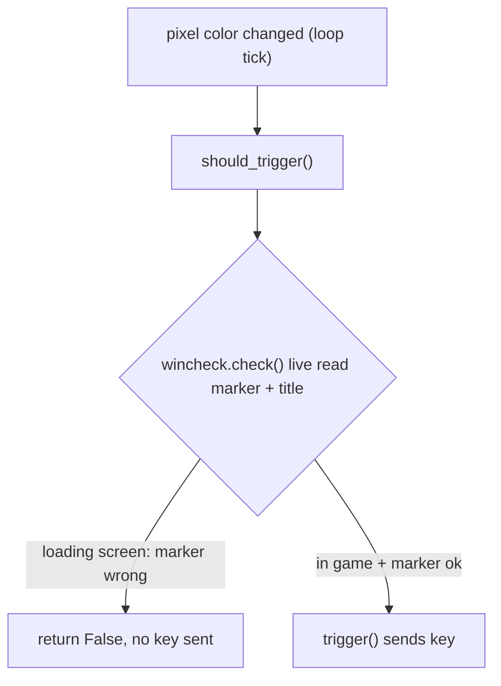

## Rationale (corrected)

This is not a performance fix. `PxlWinWatch` polls ~5x/sec, trivial next to the main loop's ~80 `GetPixel`/sec. The real defect is a **staleness race**: the `active` flag can be ~200ms stale, so when a loading screen blacks out the HP/MP pixels, `PxlReaction.should_trigger()` (`pxlreactHL.py:260`) still sees `active == True` and fires a key into the loading screen. An on-demand `check()` evaluated against the **live marker pixel at fire time** removes the stale window.

Critical requirement: the live check must guard the firing gates (`pxlreactHL.py:260` and `pxl_remap.py:348`), not just the loop gate at `pxlreactHL.py:71`.

## New module: `pxl_wincheck.py`

Port `PxlWinCheck` from `[pxl_winwatch.py](pxl_winwatch.py)`, dropping all threading:

- Keep config: `target_app`, `marker_x/y`, `marker_color`.
- Keep `in_target_app()` and `marker_ok()` unchanged.
- Replace `update()`/`active`/`start()`/`stop()`/`_run()`/`_thread`/`_stop_event`/`interval` with a single:

```python
def check( self ):
    return self.in_target_app() and self.marker_ok()
```

- Port `update_slow()` as `check_slow()` (returns the bool, keeps the diagnostic print) for the "why is it inactive" debugging path.

## Call-site changes

- `[pxlreactHL.py](pxlreactHL.py)`
  - Line 14 import -> `from pxl_wincheck import PxlWinCheck`.
  - Line 38 -> `self.wincheck = PxlWinCheck()`.
  - Line 46 -> pass `self.wincheck` to `PxlRemapper(...)`.
  - Line 71 loop gate -> `if self.wincheck.check():` (preserves "don't poll pixels when not in-game").
  - Line 260 `should_trigger` -> `if self.state != "ready" or not self.pxl.app.wincheck.check():` (this is the line that actually fixes the bug).

- `[pxl_remap.py](pxl_remap.py)`
  - Constructor param `winwatch` -> `wincheck`; `self.winwatch` -> `self.wincheck`; update the docstring at lines 207-216.
  - Line 348 -> `if not self.wincheck.check():`.

- Delete `[pxl_winwatch.py](pxl_winwatch.py)`.

- `[README.md](README.md)`: update the four references (lines 22, 74, 93, 129) from `pxl_winwatch` / `PxlWinWatch.active` to `pxl_wincheck` / `PxlWinCheck.check()`.

## Gate flow after change



## Compatibility breaks (per project rules, noted not preserved)

- `pxl_winwatch.py` removed; `PxlWinCheck` no longer auto-starts a background thread, exposes no `active` attribute, and has no `start()`/`stop()`.
- `PxlRemapper.__init__` signature changes (`winwatch` -> `wincheck`).
- Redundant double-evaluation: both the loop gate and `should_trigger` call `check()`; intentional and cheap (the `should_trigger` call only runs on actual color changes). Inherited limitations (exact-match `marker_ok`, single bad-read suppressing one reaction) are unchanged.
